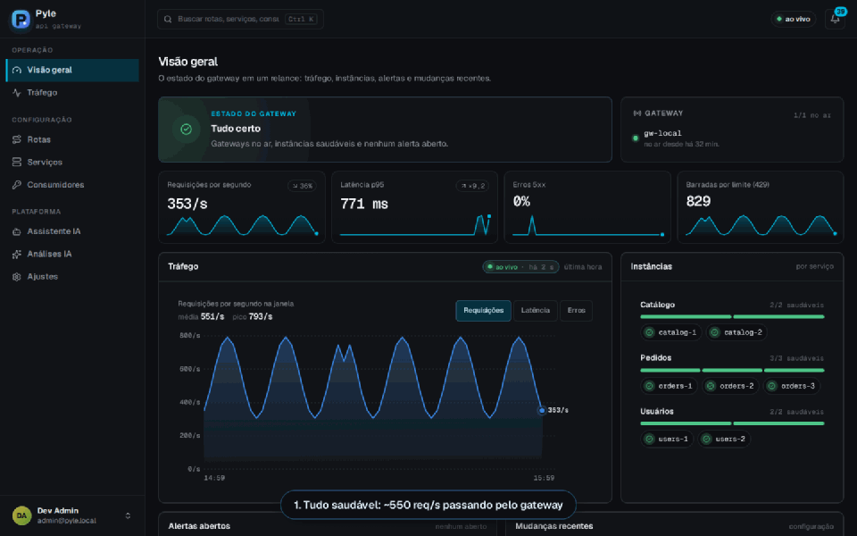
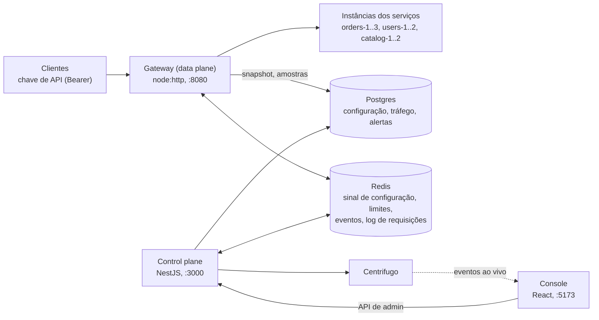

# pyle

[](LICENSE)


API gateway experimental em TypeScript, escrito do zero para implementar na
prática os mecanismos de um gateway de verdade: data plane e control plane
separados, roteamento, autenticação, rate limiting, balanceamento,
resiliência, observabilidade e operação assistida por IA.

O gateway roda separado do control plane e continua atendendo com o último
snapshot de configuração mesmo com o control plane ou o Postgres fora do ar.
Uma mudança de configuração chega a todos os gateways em menos de um segundo,
por pub/sub, e entra numa troca atômica de snapshot.

Um console em React mostra a operação ao vivo. O projeto traz instâncias de
demonstração com injeção de falhas, um bot de carga e uma camada de IA que
analisa o estado do sistema e propõe ações. A IA não age sozinha: cada
proposta vira um cartão que o operador precisa confirmar.



## O que o projeto demonstra

- Roteamento por prefixo mais longo, métodos por rota, rotas públicas ou
  autenticadas.
- Chaves de API guardadas só como hash, com a lista de rotas que cada
  consumidor pode chamar.
- Rate limiting distribuído no Redis, compartilhado por todos os gateways,
  em dois níveis: por consumidor e por consumidor numa rota.
- Balanceamento round robin, menos conexões ou aleatório ponderado, com
  drenagem e peso por instância.
- Health check ativo, circuit breaker por instância e retry em outra
  instância para requisições idempotentes.
- Configuração no Postgres, auditada na mesma transação da escrita e
  propagada para vários gateways.
- Métricas Prometheus, `x-request-id`, W3C Trace Context e o estado de cada
  instância em tempo real.
- Réplicas gerenciadas pelo Docker, com um reconciliador que leva o estado
  real até o pedido.
- IA operacional: análises do tráfego e propostas de ação com confirmação
  explícita do operador.

A prova está nos testes: 1.047 unitários, 46 de integração e 50 e2e no
backend, 677 no frontend, 17 no navegador com Playwright e um contrato de
tipos entre o console e a API verificado no CI. O backend tem 98,7% de
cobertura de instruções. O benchmark contra o nginx se reproduz com um
comando.

## A demo

A demo existe para deixar esses mecanismos visíveis em poucos minutos. O bot
de carga já manda tráfego quando a stack sobe, então basta abrir o console.

1. Em Serviços, abra `orders-2` e escolha "Fora do ar" no painel de chaos.
   O health check tira a instância da rotação, o circuito abre e os retries
   levam as requisições idempotentes para as outras instâncias.
2. Um alerta aparece na Visão geral. Clique em "Normalizar" e veja a
   instância voltar.
3. Escolha "Lentidão" na mesma instância. A instância continua saudável para
   o health check, mas o p95 da rota passa do limite e o alerta abre.
4. Pergunte ao assistente _"Por que o p95 de /api/orders subiu?"_. Ele
   consulta o tráfego, as mudanças de configuração e o estado das
   instâncias, e acha o chaos.
5. Peça para tirar a `orders-2` do balanceamento. Ele monta um cartão de
   proposta; digite o nome da instância, confirme e veja a drenagem.

Dá para testar também o balanceamento ponderado (Tráfego, rota Catálogo),
revogar e restaurar uma chave (Consumidores) e escalar um serviço (Serviços,
"Réplicas extras"). As [telas comentadas](showcase/README.md) mostram o
console inteiro.

## Quickstart

Precisa de Docker e Node 22. Um comando prepara e sobe tudo:

```sh
./entrypoint.sh
```

Ele confere a máquina, cria os `.env` a partir dos exemplos (sem mexer nos
que já existem), instala as dependências, sobe a infraestrutura com o bot de
carga, roda as migrations, sobe o control plane, o gateway e o console e, na
primeira vez, cria os dados de demo com 24 h de histórico. Ctrl+C para os
processos; `./entrypoint.sh down` derruba os containers. `./entrypoint.sh help`
lista os outros comandos (`status`, `seed`, `reset`, `containers`).

Os mesmos passos à mão:

```sh
cp .env.example .env && cp backend/.env.example backend/.env && cp frontend/.env.example frontend/.env
docker compose up -d --wait           # Postgres, Redis, Centrifugo, 7 instâncias de demo e o bot de carga

cd backend && npm ci && npm run db:migrate
npm run dev                           # terminal 1: control plane e gateway
npm run seed                          # em outro shell, uma vez: serviços, rotas, consumidores, 24 h de histórico

cd ../frontend && npm ci && npm run dev   # terminal 2: o console
```

| O quê                  | Onde                           |
| ---------------------- | ------------------------------ |
| Console                | http://localhost:5173          |
| Gateway                | http://localhost:8080          |
| API de admin (Swagger) | http://localhost:3000/api-docs |
| Métricas do gateway    | http://localhost:8090/metrics  |

Entre com `admin@pyle.local` / `pyle-admin-dev`. As chaves de API dos
consumidores ficam em `backend/consumer-keys.local.json`, que o git ignora:

```sh
KEY=$(node -p "require('./consumer-keys.local.json')['web-app'][0]")
curl -i -H "Authorization: Bearer $KEY" http://localhost:8080/api/orders/1
```

A IA precisa de `AI_MODEL` e `AI_API_KEY` em `backend/.env`; todo o resto
funciona sem elas. Para rodar a stack inteira em containers, use
`./entrypoint.sh containers`.

## Arquitetura



O gateway é `node:http` puro, sem framework no caminho quente. Ele lê a
configuração do Postgres como um snapshot imutável e troca o snapshot inteiro
quando o control plane avisa pelo Redis que algo mudou; cada requisição vê
uma única versão. Saúde e circuito ficam na memória de cada processo de
gateway, e os limites de requisições ficam em contadores no Redis que todos
compartilham.

O control plane é NestJS em camadas (interface, aplicação, domínio,
infraestrutura). Os serviços dependem de portas de repositório, e não do
Prisma, por isso o domínio é testado sem banco. Os tipos da API do console são
escritos à mão, e um contrato verificado na compilação quebra o CI quando
eles se afastam dos DTOs do control plane.

O caminho de uma requisição, a observabilidade e a organização do código
estão em [docs/implementation.md](docs/implementation.md); o desenho geral,
em [docs/architecture.md](docs/architecture.md).

## Principais decisões

- O data plane é um processo próprio, em `node:http` puro, para o tráfego não depender do control plane.
- A configuração fica no Postgres e é recarregada inteira a cada sinal de pub/sub, com troca atômica.
- Saúde e circuito são de cada processo de gateway, espelhados no Redis só para exibição.
- A latência é guardada em histogramas de faixas fixas, para os percentis de vários gateways poderem ser combinados.
- Os limites usam janela fixa no Redis e deixam passar se ele cair.

## Limitações conhecidas

É um projeto de estudo, não um gateway para produção. As limitações que eu
conheço:

- A saúde das instâncias é medida por processo. Dois gateways podem
  discordar sobre uma instância por alguns segundos, e cada um sonda todas
  elas.
- Limites em janela fixa deixam passar até o dobro na virada da janela, e
  não valem enquanto o Redis estiver fora do ar.
- O gateway não trata TLS nem CORS. Ele precisa de um terminador TLS na
  frente, e navegadores não conseguem chamá-lo de outra origem.
- Não há controle de admissão: acima de uns 2.000 req/s por processo o
  gateway enfileira em vez de recusar.
- Há um Postgres só, sem réplica. Se ele cair, o gateway segue servindo a
  última configuração, e o resto para.
- A escala precisa do socket do Docker, que equivale a root no host, e só
  gerencia os serviços de demo.
- O tracing só propaga o contexto; o gateway não exporta spans.
- Os percentis são aproximações dentro das faixas do histograma, e as
  métricas zeram quando o processo reinicia.

## Segurança

As senhas de admin usam scrypt, e a sessão combina JWTs curtos com refresh
tokens rotativos que detectam reuso, num cookie `httpOnly` e
`SameSite=Strict`. As chaves de API ficam só como hash SHA-256 e aparecem uma
vez; uma revogação vale em menos de um segundo e pode ser desfeita por 60 s,
com registro na auditoria. Toda entrada passa por DTOs validados, e o control
plane se recusa a subir em produção com os segredos de exemplo. A IA só
propõe, e as ações destrutivas pedem que o operador digite o nome do alvo.

## Testes

| Suíte               | O que cobre                                                     | Testes   |
| ------------------- | --------------------------------------------------------------- | -------- |
| Backend, unitários  | Serviços, regras de domínio, pipeline do gateway                | 1.047    |
| Backend, integração | Repositórios e serviços contra Postgres e Redis reais           | 46       |
| Backend, e2e        | Control plane e gateway em sockets reais, HTTP de ponta a ponta | 50       |
| Frontend            | Hooks, funções puras e componentes com lógica                   | 677      |
| Navegador           | O console inteiro com Playwright                                | 17       |
| Contrato da API     | Tipos do console contra os DTOs do control plane                | 48 pares |

A cobertura do backend, somando as três suítes, é de 98,7% das instruções e
92,7% dos ramos, com um mínimo exigido no CI. Os comandos ficam no
`package.json` de cada lado: `npm test`, `npm run test:feature`,
`npm run test:e2e` e, no frontend, `npm run test:e2e` para o Playwright.

## Benchmark

O benchmark não tenta competir com o nginx. Ele mede quanto custam as camadas
deste gateway (roteamento, autenticação, rate limiting) sobre um proxy que
não faz nada disso. Um processo de gateway e um nginx fazem o mesmo proxy na
mesma máquina, com a carga subindo no k6 até quebrar:

| Alvo                        | Joelho (req/s) | p50 a 1000 req/s | p99 a 1000 req/s |
| --------------------------- | -------------- | ---------------- | ---------------- |
| nginx, 1 worker             | 16.000         | 0,23 ms          | 0,36 ms          |
| pyle, rota pública          | 2.000          | 0,44 ms          | 0,92 ms          |
| pyle, chave de API + limite | 2.000          | 0,72 ms          | 1,28 ms          |

Abaixo do joelho, o gateway acrescenta bem menos de um milissegundo com tudo
ligado. Um processo esgota a CPU entre 2.000 e 3.000 req/s (uns 300 µs por
requisição, contra 60 µs do nginx); para ir além, rodam-se mais processos,
que só compartilham Redis e Postgres. `npm run bench`, em `backend/`,
reproduz tudo (precisa de `k6` e `nginx` instalados).

## Documentação

- [Telas comentadas](showcase/README.md): o console, tela por tela.
- [Arquitetura](docs/architecture.md): os processos, o pipeline, a configuração, a telemetria e a IA.
- [Detalhes de implementação](docs/implementation.md): cada camada, observabilidade e organização do código.
- [Instâncias de demo](infra/demo-service/README.md): as rotas e o chaos.

## Stack

TypeScript e Node 22 em tudo. No backend, `node:http` no gateway, NestJS no
control plane, Prisma com Postgres, ioredis, Centrifugo, dockerode e o SDK da
Anthropic (ou Groq). No frontend, React, Vite, i18next e gráficos SVG feitos
à mão, sem biblioteca de gráficos. Docker Compose, nginx e GitHub Actions na
infraestrutura.

## Licença

[MIT](LICENSE).
