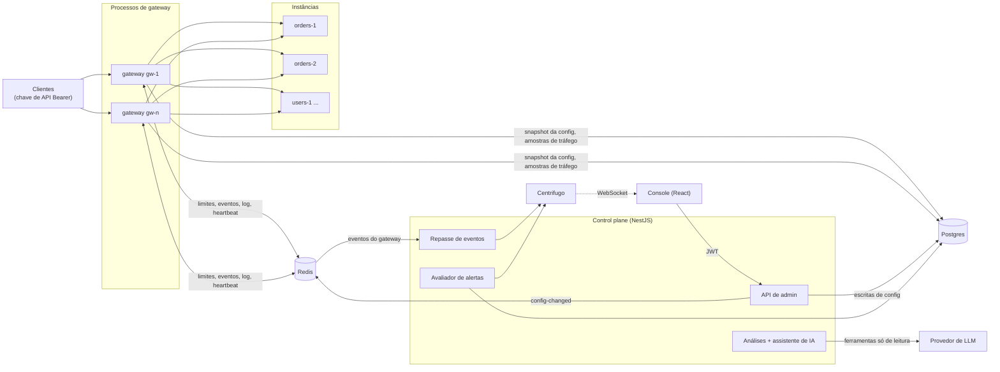
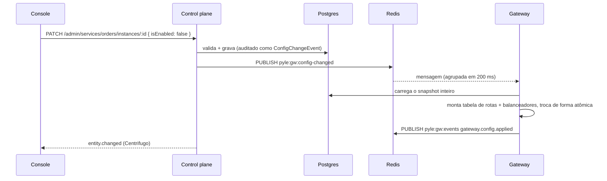
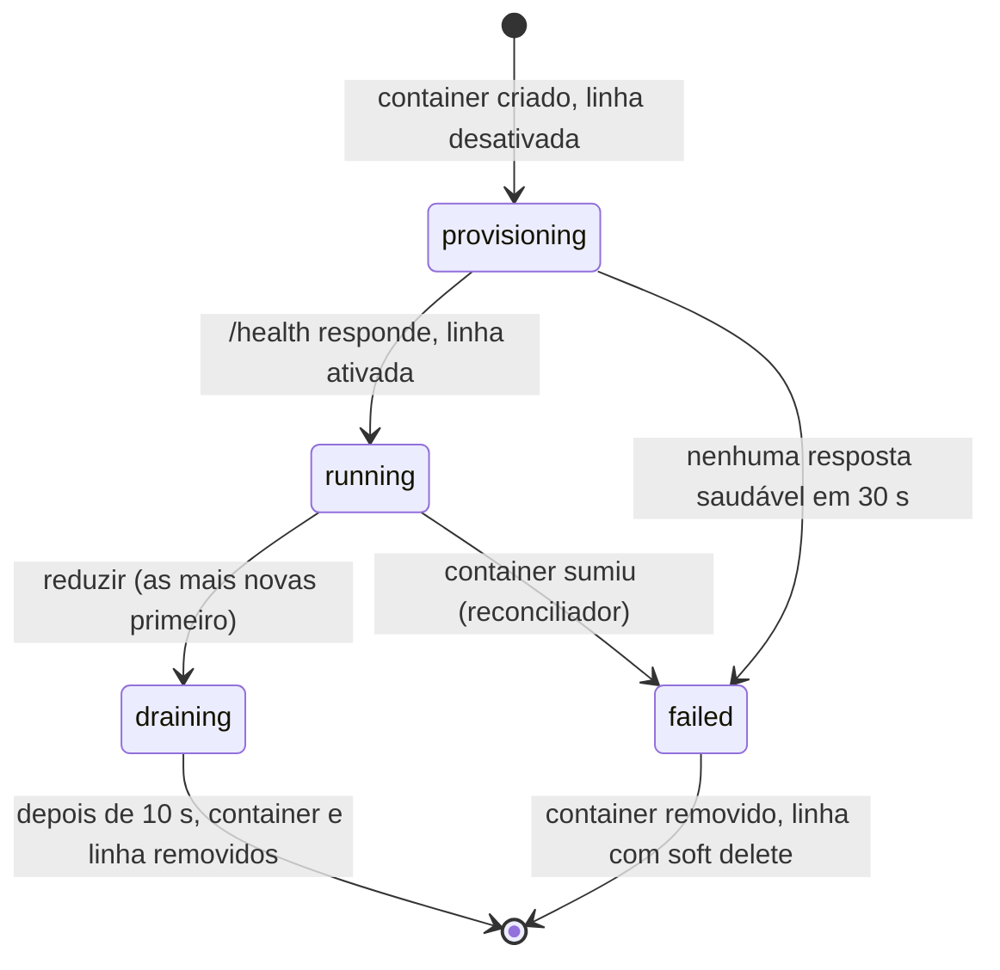
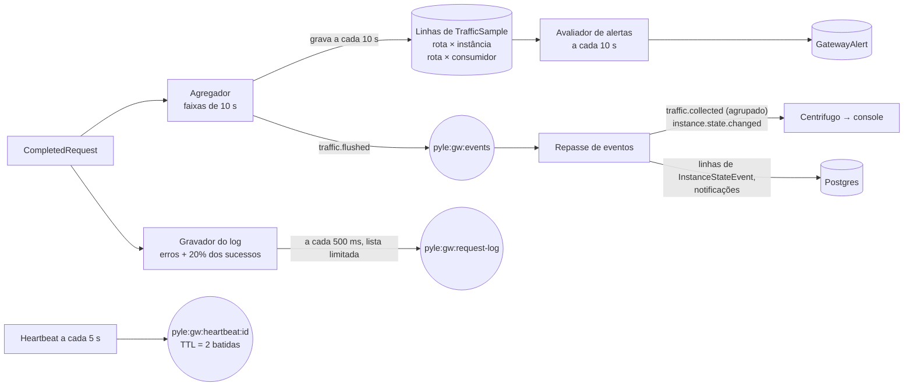

# Arquitetura

O pyle tem dois processos, cada um um app do workspace npm de `backend/`,
mais o console. O que os dois usam fica num terceiro workspace,
`@pyle/shared` (`backend/packages/shared/`):

| Processo             | Ponto de entrada                                        | Papel                                                                           |
| -------------------- | ------------------------------------------------------- | ------------------------------------------------------------------------------- |
| Gateway (data plane) | `apps/gateway/src/main.ts`, porta 8080 (+ 8090 interna) | Atende o tráfego dos clientes. `node:http` puro, sem framework.                 |
| Control plane        | `apps/control-plane/src/main.ts`, porta 3000            | API de admin, auth, consultas de tráfego, alertas, IA, eventos ao vivo. NestJS. |
| Console              | `frontend/`, porta 5173                                 | React + Vite, só fala com o control plane.                                      |

Eles dividem o Postgres (configuração, amostras de tráfego, alertas,
análises), o Redis (sinais de configuração, contadores de limite, eventos,
log de requisições, heartbeats) e o Centrifugo (push para o console). Assim o
tráfego continua passando mesmo com o control plane fora do ar.

## O pipeline da requisição

`apps/gateway/src/pipeline/handle-request.ts`. Cada etapa passa a requisição
adiante ou responde com o erro JSON do gateway
(`{ "error": "<código>", "message": "...", "requestId": "..." }`).

| #   | Etapa                                                                                                                                                                                                                                | Recusa com                                                            |
| --- | ------------------------------------------------------------------------------------------------------------------------------------------------------------------------------------------------------------------------------------ | --------------------------------------------------------------------- |
| 1   | **Rota** pelo prefixo mais longo (`route-table.ts`)                                                                                                                                                                                  | `404 route_not_found`                                                 |
| 2   | **Método** contra a lista da rota (vazia = qualquer um)                                                                                                                                                                              | `405 method_not_allowed`                                              |
| 3   | **Chave de API** do `Authorization: Bearer`, com hash e resolvida pelo cache de chaves; confere se o consumidor pode usar a rota. Rotas públicas pulam esta etapa.                                                                   | `401 missing_api_key`, `401 invalid_api_key`, `403 route_not_allowed` |
| 4   | **Limite de requisições**: o limite do consumidor, depois o limite por consumidor da rota (anônimos: por IP). Deixa passar sem Redis.                                                                                                | `429 rate_limited` + `Retry-After`                                    |
| 5   | **Escolha da instância**: o balanceador do serviço (round robin, menos conexões, aleatório ponderado) entre as instâncias elegíveis: ativas, não tiradas pelo health check, sem circuito aberto                                      | `503 no_healthy_instance`                                             |
| 6   | **Repasse** com o timeout da rota ou do serviço por tentativa. `GET`/`HEAD`/`OPTIONS` sem corpo tentam de novo em outra instância até `retryMaxAttempts`, dentro de `GATEWAY_MAX_REQUEST_TIMEOUT_MS`. A resposta volta em streaming. | `502 upstream_unreachable`, `504 upstream_timeout`                    |

A instância recebe `X-Forwarded-For/Proto/Host`, `X-Request-Id`,
`X-Pyle-Consumer` e `X-Pyle-Route`; o `Authorization` do cliente não é
repassado. O cliente recebe `X-Request-Id`, `X-Pyle-Instance`,
`X-Pyle-Attempts` e os cabeçalhos `X-RateLimit-*`.

Toda requisição, recusada ou não, termina como um `CompletedRequest`
entregue aos observadores: agregação de tráfego, log de requisições e uso
das chaves.

As funcionalidades se encaixam por interfaces em `apps/gateway/src/contracts/`
(`LoadBalancer`, `InstanceAvailability`, `AttemptObserver`,
`RequestObserver`, `RetryPolicy`, `GatewayEventSink`, `InstanceStateSource`),
cujo padrão não faz nada. O `GatewayApp` junta duas extensões: resiliência
(`apps/gateway/src/resilience/`) e telemetria (`apps/gateway/src/telemetry/`).

## Como a configuração chega aos gateways

A cada `GATEWAY_CONFIG_REFRESH_MS` (30 s) o gateway recarrega de qualquer
jeito, caso tenha perdido uma mensagem. Uma recarga que falha mantém o
snapshot anterior. Uma mudança num consumidor ou numa chave também limpa o
cache de chaves do gateway.

## Estado de resiliência

Cada gateway tem a própria visão de cada instância; nenhum gateway lê a
visão de outro para rotear:

- **Saúde**: sondas ativas em `healthCheck.path`, com limiares para ficar
  fora do ar e para voltar.
- **Circuito**: abre depois de falhas seguidas (5xx, timeout, erro de
  conexão), fica aberto por `cooldownMs` e então deixa passar uma requisição
  de teste.
- **Em voo**: requisições mandadas para a instância agora, usadas pelo
  balanceamento por menos conexões.

As transições saem como eventos `instance.state.changed`, e o estado inteiro
é copiado a cada heartbeat para o hash `pyle:gw:instance-state` do Redis, de
onde o console lê.

## Réplicas gerenciadas

Serviços com um perfil de escala podem rodar instâncias extras que o control
plane cria como containers,
quando `SCALING_ALLOWED=true`. O `PUT /admin/services/:slug/replicas` grava o
número pedido e responde; o `src/scaling/` converge em segundo plano:

Cada passo é uma mudança de configuração auditada, então os gateways
recarregam e o console atualiza do mesmo jeito que numa mudança feita à mão.
Um reconciliador (a cada 30 s, na mesma fila serializada dos pedidos de
escala) remove containers marcados que ninguém reconhece e faz cada serviço
escalável convergir de novo.

## Telemetria

- **Amostras de tráfego**: por faixa de 10 segundos e por dimensão, a
  contagem de requisições, as classes de status, os 429, os erros do gateway,
  os retries e um histograma de latência. Os percentis saem da soma dos
  histogramas, o que permite combinar janelas e gateways. Gravar
  duas vezes não duplica (chave única por gateway, faixa e dimensão).
- **Log de requisições**: uma lista limitada no Redis
  (`REQUEST_LOG_MAX_ENTRIES`), e não uma tabela: serve para "o que acabou de
  acontecer", não para histórico.
- **Heartbeat**: uma chave por gateway com TTL de duas batidas. O control
  plane as lista para mostrar quais gateways estão vivos, qual versão de
  configuração cada um roda e se o limitador está deixando passar.
- **Alertas**: regras por tipo (`route_p95_latency`, `route_error_rate`,
  `instance_unhealthy`, `circuit_open`) com um limite e um número de janelas
  seguidas de 10 segundos. Um alerta aberto por alvo, garantido por um
  índice único parcial; ele se resolve sozinho quando a condição passa.
- **Retenção**: amostras, eventos de estado e alertas resolvidos mais velhos
  que `TRAFFIC_RETENTION_HOURS` são apagados em lotes.

## Tempo real no console

O control plane publica num canal do Centrifugo (`admin:events`) que só
operadores podem assinar. Eventos: `entity.changed` (uma escrita de
configuração), `traffic.collected` (amostras novas para buscar),
`instance.state.changed`, `chaos.changed`, `alert.triggered`/`alert.resolved`,
`ai.analysis.ready` e as mudanças de saúde do sistema. As páginas buscam de
novo o que o evento afeta, com limite de frequência.

## IA

Tanto as análises quanto o assistente dão ao modelo ferramentas só de
leitura sobre os serviços do control plane (tráfego, instâncias, eventos de
saúde, erros recentes, mudanças de configuração, alertas, saúde do sistema,
análises anteriores). A saída das ferramentas é compacta (no máximo 30
pontos por série) e nunca leva segredos.

- **Análises** (`src/ai-analysis/`): da plataforma, de uma rota ou de um
  serviço. O resultado da primeira ferramenta é buscado antes da chamada,
  para poupar uma ida e volta. O modelo responde por uma ferramenta
  `record_analysis`, com um veredito estruturado e ações sugeridas
  opcionais; cada análise é guardada com o resumo da anterior, para a
  próxima poder mostrar a tendência.
- **Assistente** (`src/ai-assistant/`): uma conversa. As ferramentas
  `propose_*` conferem o estado atual e só registram uma proposta se ela
  mudar algo; senão o modelo recebe o motivo de volta. As propostas voltam
  ao console como cartões e nunca rodam no servidor: o operador confirma e o
  console chama o endpoint de admin normal, então valem a mesma validação e
  a mesma auditoria. As destrutivas (drenar, revogar uma chave, derrubar uma
  instância) pedem que o operador digite o nome do alvo.

Provedores: Anthropic ou Groq, atrás de uma interface `AiModelClient`.
