# Pyle em imagens

Um passeio pelo console do Pyle, o API gateway deste repositório, em 25
telas. A ordem conta uma história: o dia a dia da operação, um incidente
investigado com a ajuda da IA e a plataforma escalando um serviço.

Tudo o que aparece aqui roda na sua máquina: o gateway, o control plane, o
console, sete instâncias de demonstração e um bot que gera tráfego o tempo
todo. Como reproduzir está [no fim da página](#como-reproduzir).

---

## O console

### 1. Login

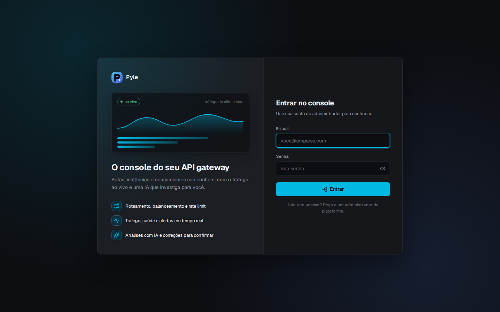

A entrada do console de operação. A sessão usa um token de acesso de vida
curta e um refresh token rotativo em cookie `httpOnly`; reusar um refresh
token já trocado derruba a sessão inteira. O login tem limite de tentativas
por IP e por e-mail, e a mensagem de erro nunca diz se foi o e-mail ou a
senha que errou.

### 2. Visão geral

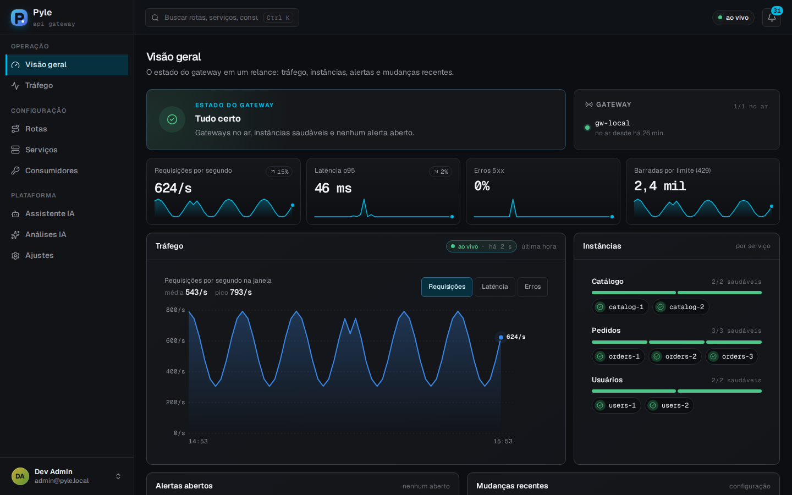

A primeira tela responde "está tudo bem?" em um relance. No topo, o
estado do gateway (aqui, "Tudo certo") e, ao lado, cada processo de gateway
com seu sinal de vida. Abaixo, os quatro números que importam (requisições
por segundo, latência p95, erros 5xx e requisições barradas por limite), com
o minigráfico dos últimos minutos e, nos dois primeiros, a variação contra a
média do período. O gráfico da última hora traz média e pico da janela, e
cada serviço mostra uma barra com a saúde das instâncias. Tudo se atualiza
sozinho pelo WebSocket, a cada 10 segundos, sem recarregar a página.

---

## Tráfego

### 3. Tráfego de todas as rotas

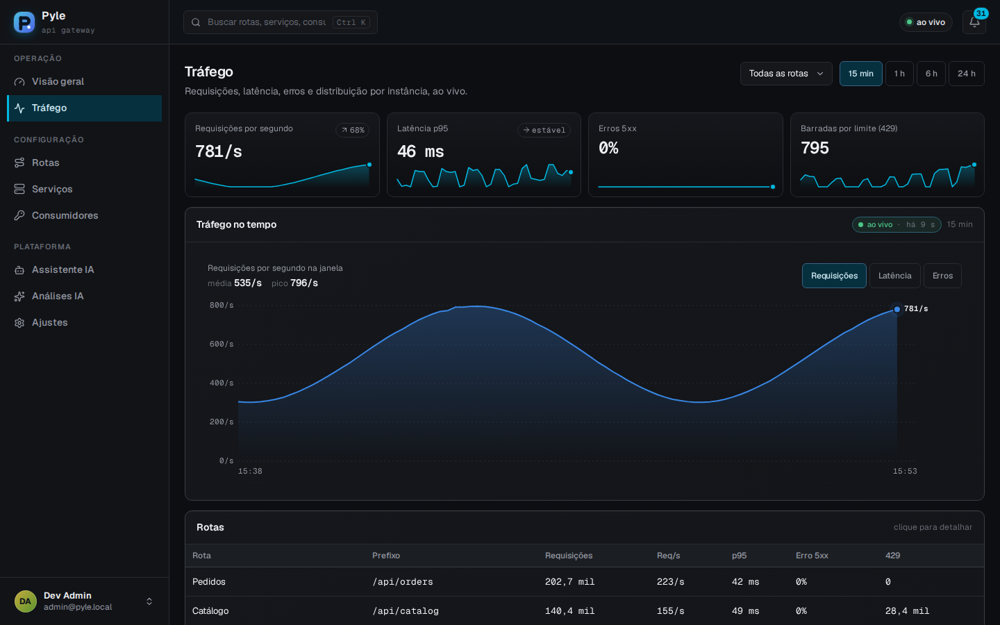

O gráfico mostra requisições, latência ou erros ao longo da janela
escolhida (15 min, 1 h, 6 h ou 24 h). Abaixo dele, cada rota com volume,
p95, taxa de erro e 429. O eixo do tempo é sempre a janela inteira, então
trocar de métrica não faz o gráfico pular; a linha se desenha de novo e a
escala acompanha as atualizações ao vivo sem saltos.

### 4. Uma rota, instância por instância

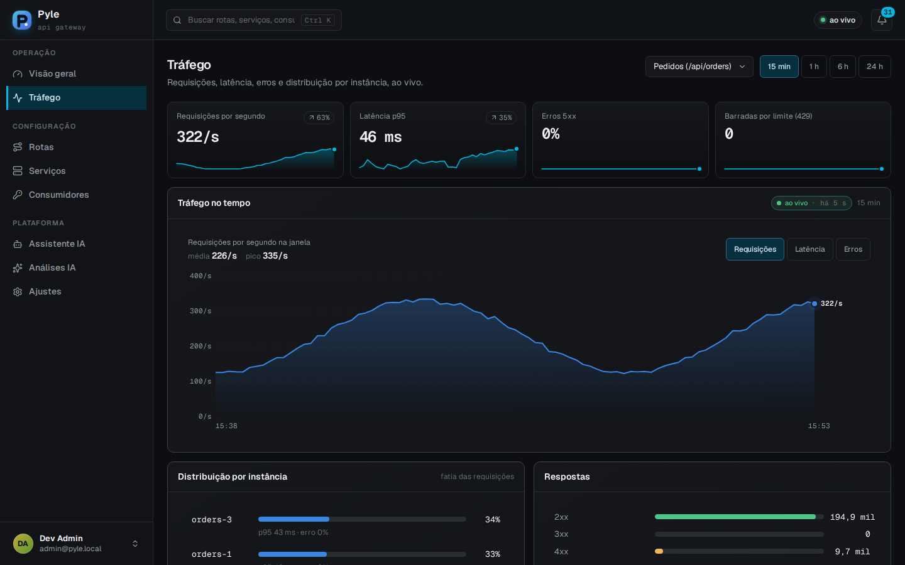

Filtrando a rota Pedidos aparece a **distribuição por instância**: o
balanceamento round-robin divide o tráfego em partes iguais entre as
instâncias fixas (cerca de um terço cada), com o p95 e a taxa de erro de cada uma ao
lado. O cartão de respostas
separa o que veio das instâncias do que o próprio gateway respondeu (401
sem chave, 403 rota não permitida, 429 limite, 503 sem instância saudável).

### 5. Log de requisições

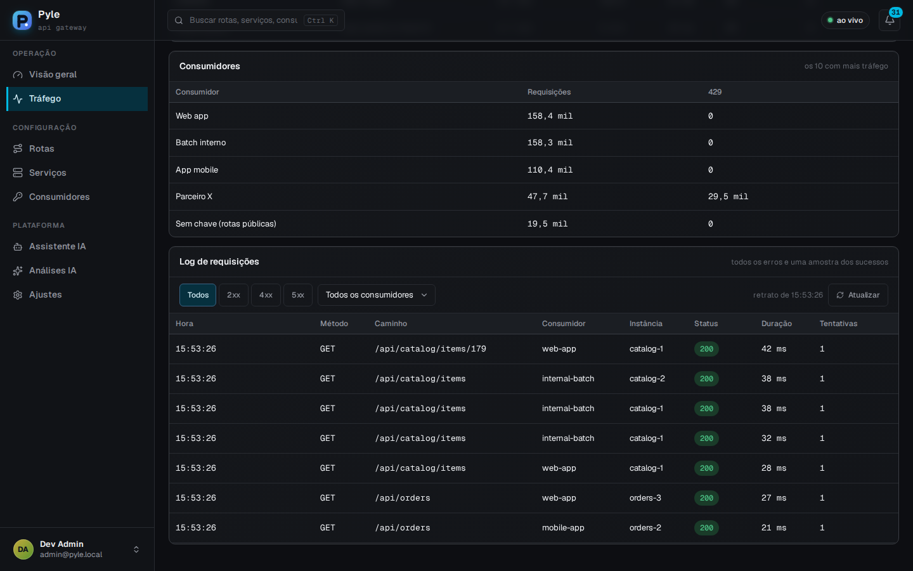

Os consumidores que mais usam o gateway e um log com **todos os erros e uma
amostra de 20% dos sucessos**, guardado no Redis com tamanho fixo. Dá para
filtrar por classe de status, consumidor e instância. O selo `GW` marca a
resposta que o gateway deu sem chegar a nenhuma instância.

### 6. Um select feito para o console

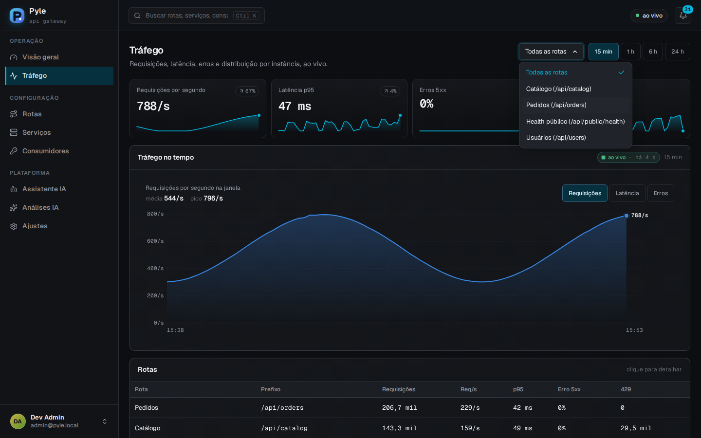

Os selects do console são um componente próprio: lista flutuante que nunca
é cortada por um card ou diálogo, navegação por teclado (setas, Home/End,
Enter, Esc) e busca pela primeira letra, com a opção atual marcada.

---

## Configuração

### 7. Rotas

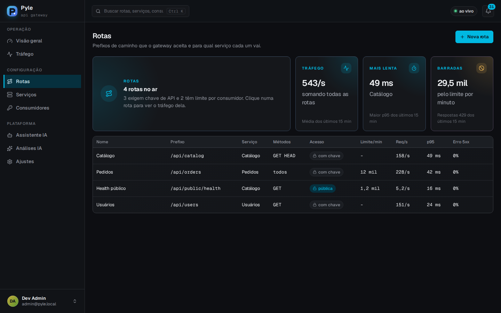

Cada rota é um prefixo de caminho apontando para um serviço, com métodos
aceitos, acesso (com chave ou pública), limite por consumidor e o tráfego
atual. O resumo no topo soma o tráfego, aponta a rota mais lenta e conta as
respostas 429. A rota mais longa que casa com o caminho vence.

### 8. Detalhe de uma rota

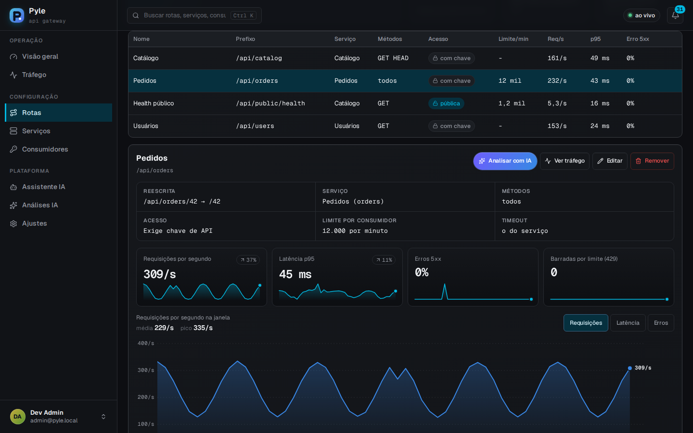

Clicar em uma rota mostra como ela reescreve o caminho
(`/api/orders/42 → /42`), suas regras e o tráfego dela. Daqui dá para pedir
uma análise da rota à IA, abrir o tráfego, editar ou remover. Toda remoção
é lógica (soft delete): o histórico continua legível.

### 9. Criar uma rota

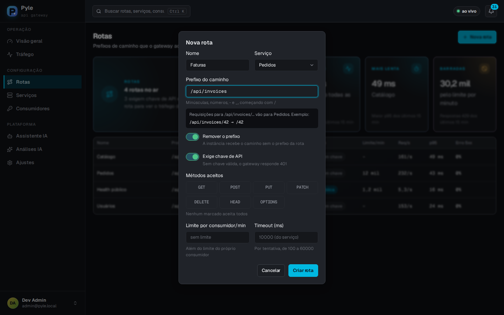

O formulário valida enquanto você digita e mostra uma prévia da reescrita do
caminho. Uma mudança salva chega a todos os gateways em menos de um
segundo: o control plane avisa pelo Redis e cada gateway troca a
configuração inteira de uma vez, de forma atômica.

### 10. Serviços e instâncias

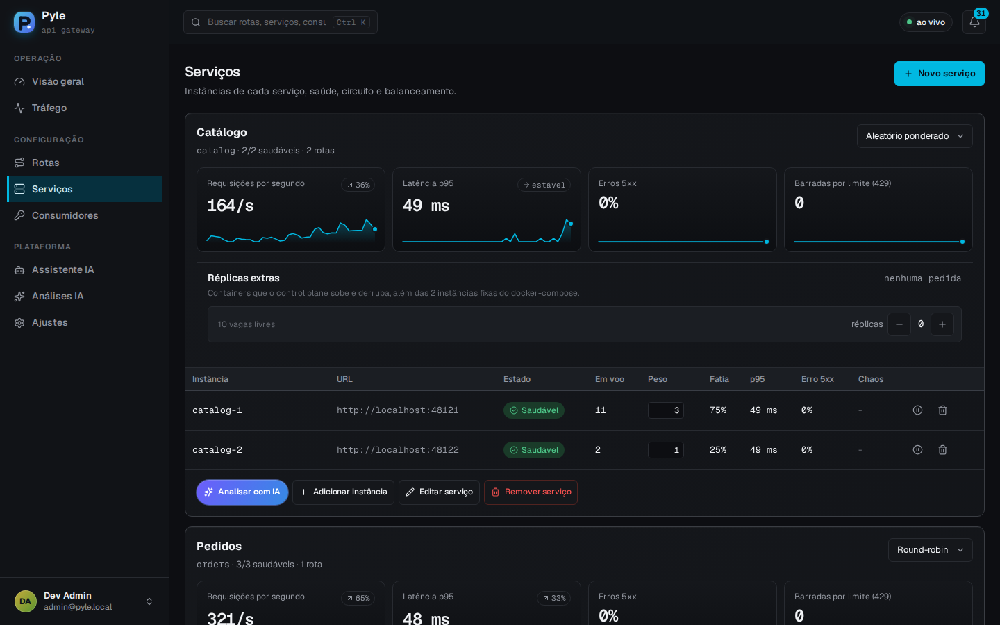

Cada serviço com sua estratégia de balanceamento (round-robin, menos
conexões ou aleatório ponderado) e suas instâncias: estado do health check,
requisições em voo, peso, fatia do tráfego, p95 e erros. No Catálogo, o
peso 3 em `catalog-1` faz a instância receber três vezes mais tráfego: 75%
contra 25%. O bloco "Réplicas extras" é onde se pede containers além das
instâncias fixas (tela 21).

### 11. Consumidores

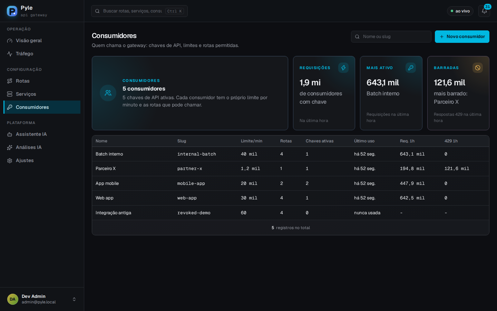

Quem chama o gateway: cada consumidor tem um limite por minuto, as rotas que
pode usar e as próprias chaves. O resumo no topo mostra o consumidor mais
ativo e o mais barrado: o Parceiro X, com limite de 1.200/min, leva milhares
de respostas 429, porque o bot simula um parceiro que passa do combinado. A
"Integração antiga" tem a chave revogada, e o bot ainda a usa para gerar 401.

### 12. Uso de um consumidor

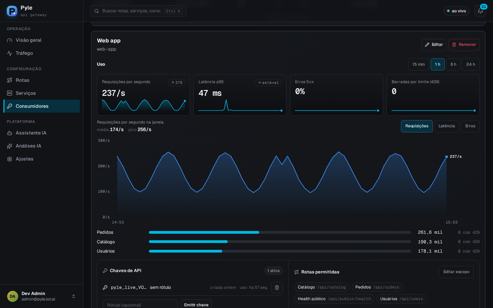

O uso de um consumidor ao longo do tempo e por rota, as chaves ativas e as
rotas permitidas.

### 13. Novo consumidor

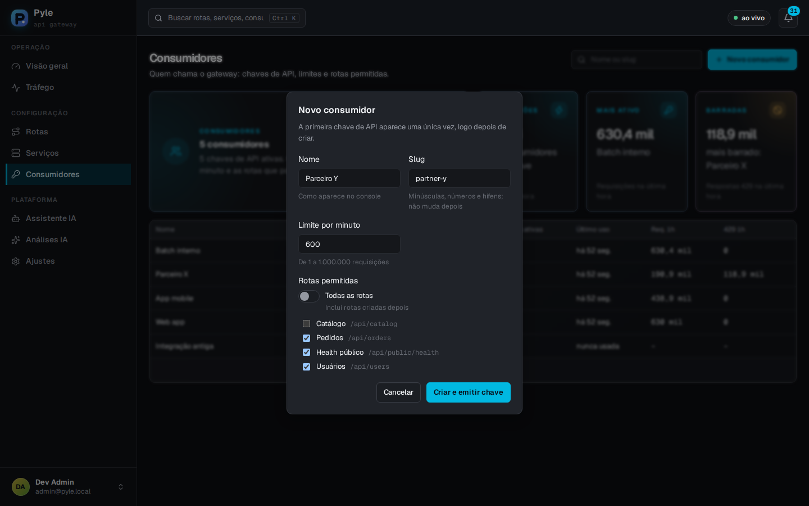

Criar um consumidor já emite a primeira chave de API.

### 14. A chave aparece uma vez só

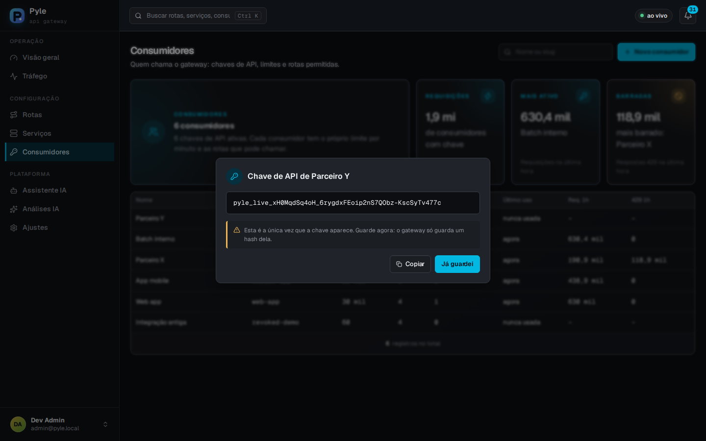

A chave é mostrada **uma única vez**: o gateway guarda apenas o hash
SHA-256 dela. Revogar uma chave tem efeito em menos de um segundo e não pede
confirmação antes: o aviso que aparece traz "Desfazer", que restaura a chave
dentro de um minuto, com registro na auditoria. (Esta chave foi revogada logo
depois da foto.)

---

## Um incidente, do alerta à correção

Para esta parte, uma das instâncias de demonstração recebeu **chaos**: 800 ms
a mais de latência em `orders-2`, injetados pelo próprio console.

### 15. O alerta

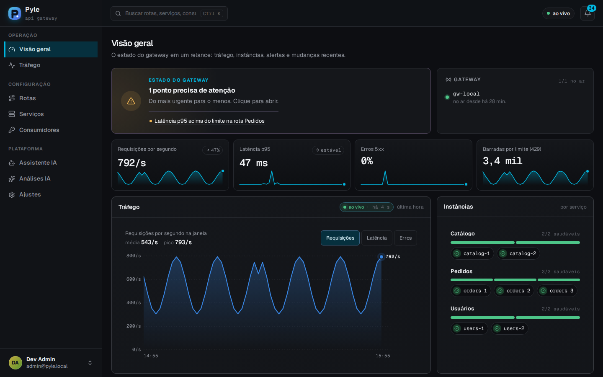

Depois de três janelas seguidas de 10 s com o p95 da rota acima de 800 ms, a
regra de alerta dispara. A visão geral passa a mostrar "1 ponto precisa de
atenção", com um link direto para a causa.

### 16. A instância culpada

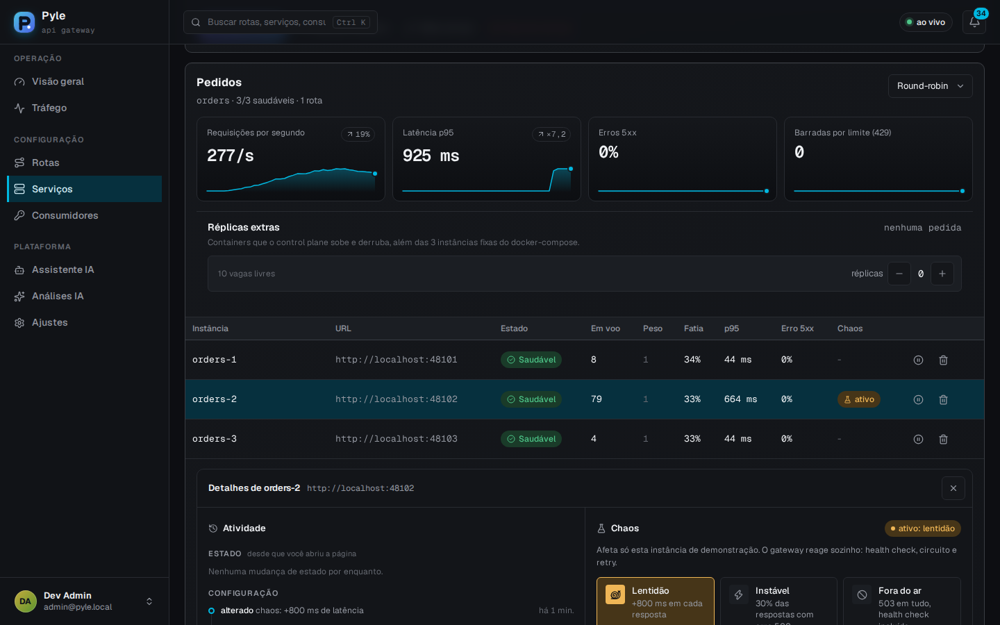

Na página de serviços, `orders-2` tem p95 de ~660 ms contra 44 ms das
irmãs, e o selo "ativo" na coluna de chaos. O detalhe mostra o painel de
chaos e o histórico de configuração da instância, escrito como frase
("chaos: +800 ms de latência"). Repare que os health checks continuam
passando: a instância está lenta, não fora do ar, e por isso o circuit
breaker não abre.

### 17. Perguntando à IA

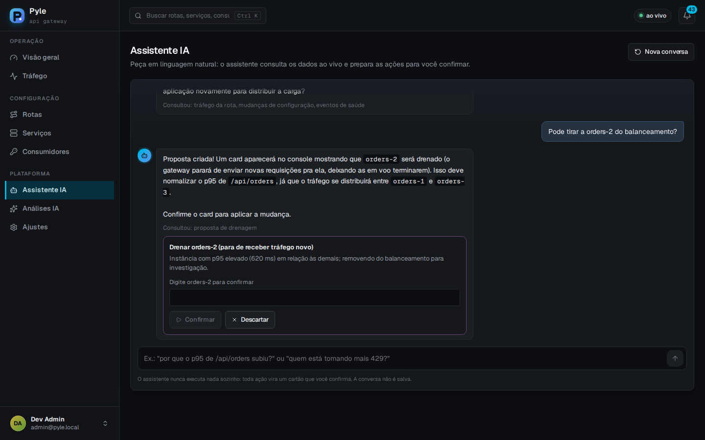

Pergunta em português comum: _"Por que o p95 de /api/orders subiu?"_. O
assistente consulta os dados ao vivo (tráfego da rota, mudanças de
configuração, eventos de saúde), encontra o chaos em `orders-2` e, quando
pedimos para tirá-la do balanceamento, monta um **cartão de proposta**. A IA
nunca executa nada sozinha: a drenagem só acontece se o operador digitar o
nome da instância e confirmar. Esta conversa foi real, com o Claude Haiku
4.5.

### 18. Análises guardadas

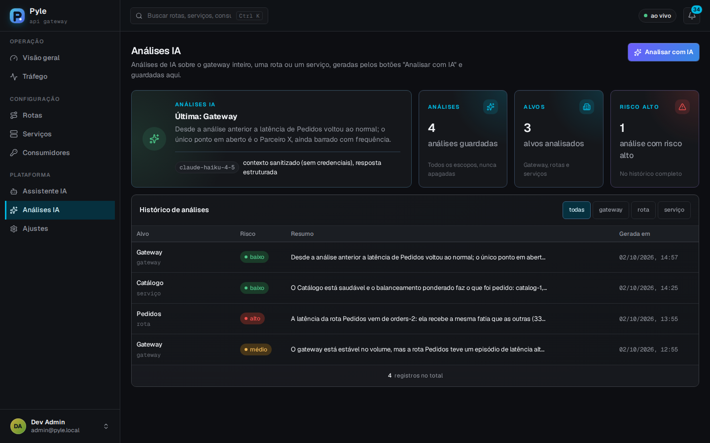

Além do assistente, qualquer tela tem um botão "Analisar com IA" para o
gateway, uma rota ou um serviço. As análises ficam guardadas, com o risco
avaliado e a tendência em relação à anterior.

### 19. Uma análise

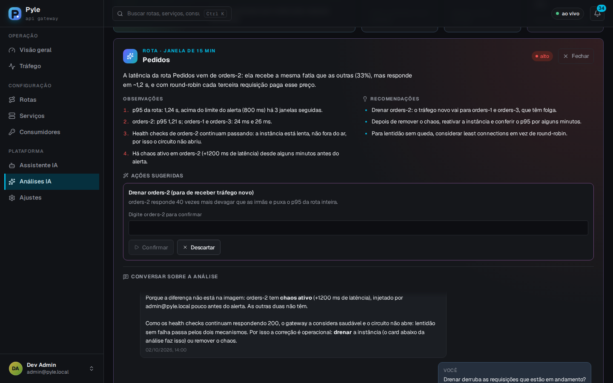

A análise da rota Pedidos durante o incidente: resumo, observações com
números, recomendações e uma **ação sugerida** (drenar `orders-2`) que, como
no assistente, só roda depois de confirmada.

### 20. Conversando sobre a análise

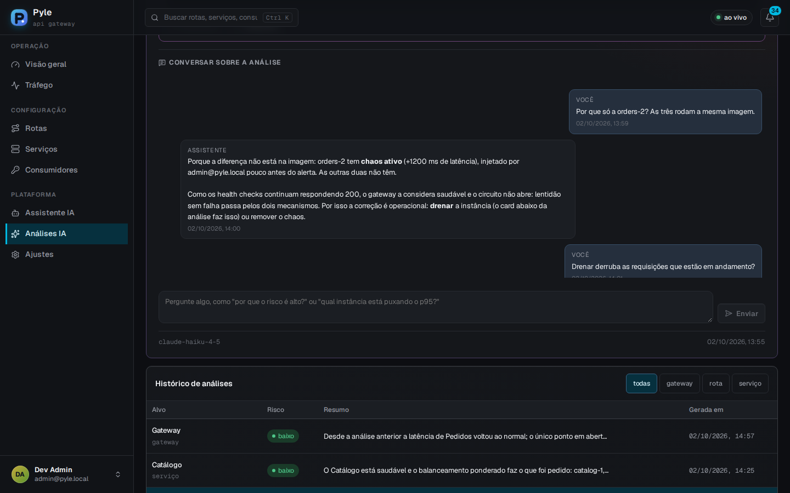

Cada análise tem uma conversa própria, salva, para tirar dúvidas sobre ela:
aqui, por que só uma instância e se drenar derruba requisições em
andamento.

---

## Escalando um serviço

### 21. Réplicas gerenciadas

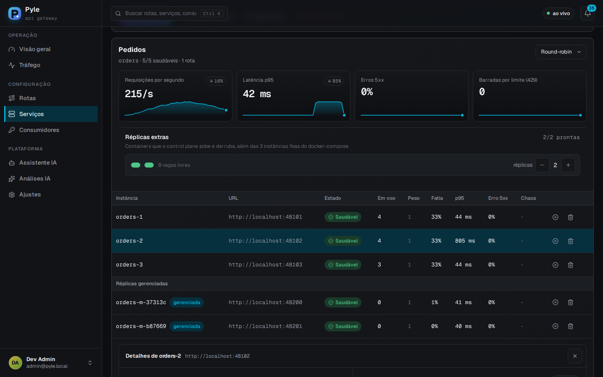

O serviço Pedidos foi escalado para **2 réplicas gerenciadas** pelo
console. O control plane cria os containers pelo Docker (as instâncias
marcadas "gerenciada"), espera ficarem saudáveis e só então os coloca na
rotação. A coluna "fatia" é medida sobre a janela de tráfego, por isso as
réplicas recém-chegadas ainda aparecem com 0 a 1% e vão convergir para os 20% de
cada uma das cinco instâncias. Ao reduzir, as réplicas são drenadas antes de sair, e
um reconciliador substitui containers que morrerem e remove os órfãos.

---

## O resto do console

### 22. Notificações

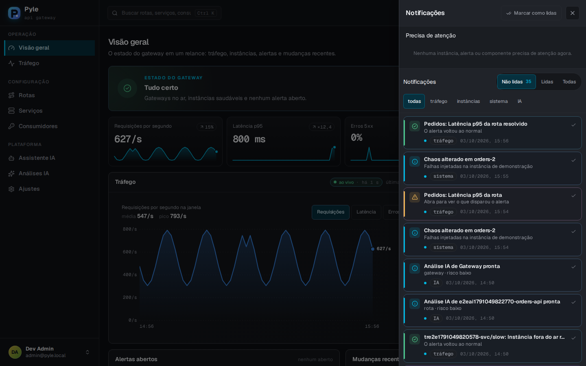

A caixa de notificações guarda o que aconteceu enquanto você não olhava:
alertas disparados e resolvidos, instâncias que caíram e voltaram, análises
prontas. Avisos iguais em sequência viram uma linha só, com a contagem.
"Precisa de atenção" lista o que ainda está aberto agora.

### 23. Busca global

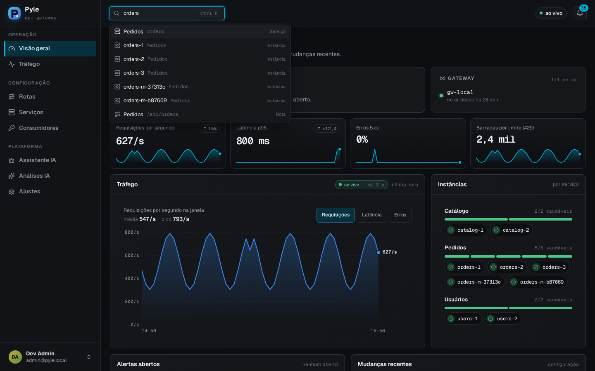

`Ctrl K` busca rotas, serviços, instâncias e consumidores de qualquer tela.

### 24. Ajustes

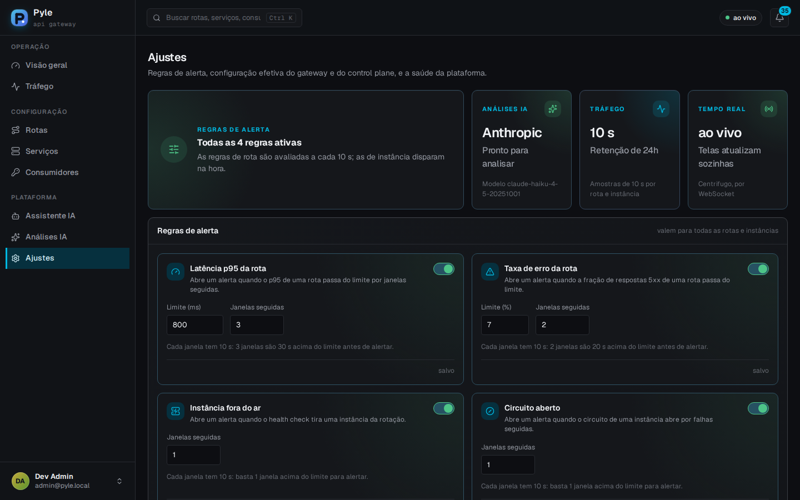

As regras de alerta, editáveis (limite e quantas janelas seguidas antes de
alertar), a configuração efetiva do gateway e do control plane e a saúde de
cada componente da plataforma.

### 25. No celular

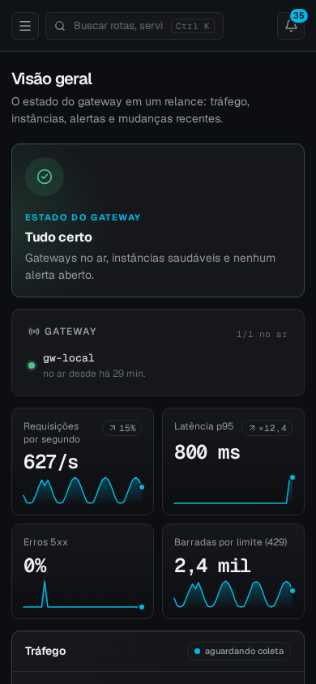

O console funciona em telas estreitas, sem rolagem lateral.

---

## Os dados das imagens

- **Tráfego**: 24 h de histórico sintético gerado pelo seed (curva diária,
  ruído e um episódio de lentidão e uma queda), mais o tráfego ao vivo do bot,
  uma onda suave entre cerca de 300 e 800 req/s a cada 10 minutos (média de
  550), com uma pequena parte de erros de propósito (chave ausente ou
  revogada, rota proibida, caminho inexistente) e o Parceiro X acima do
  limite.
- **Incidente e scaling**: reais, feitos pelo console durante as capturas
  (chaos, alerta, containers criados pelo Docker).
- **Assistente (17)**: conversa real com o Claude Haiku 4.5.
- **Análises e notificações (18 a 20, 22)**: dados de mock escritos pelo
  script `backend/scripts/showcase-data.ts`, para mostrar o histórico de
  análises sem gastar chamadas ao modelo.

## Como reproduzir

Com a stack do [README principal](../README.md) no ar:

```sh
cd backend
npm run dev              # control plane e gateway (o bot já roda no Compose)
npm run seed             # serviços, rotas, consumidores e 24 h de histórico
npm run showcase:data    # análises, conversa e notificações de mock
docker compose restart bot   # o bot lê as chaves uma vez: reinicie após o seed
```

Depois, no console (http://localhost:5173, `admin@pyle.local` /
`pyle-admin-dev`): chaos de lentidão em `orders-2` para o incidente, e 2
réplicas gerenciadas em Pedidos para o scaling (precisa do Docker e de
`SCALING_ALLOWED=true`). As capturas foram feitas em 1440 × 900 (390 × 844
no celular).
